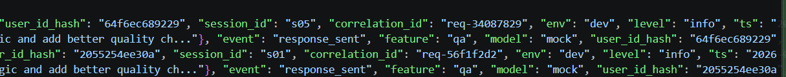
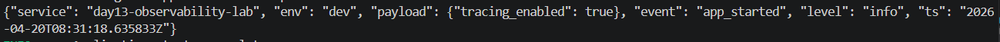
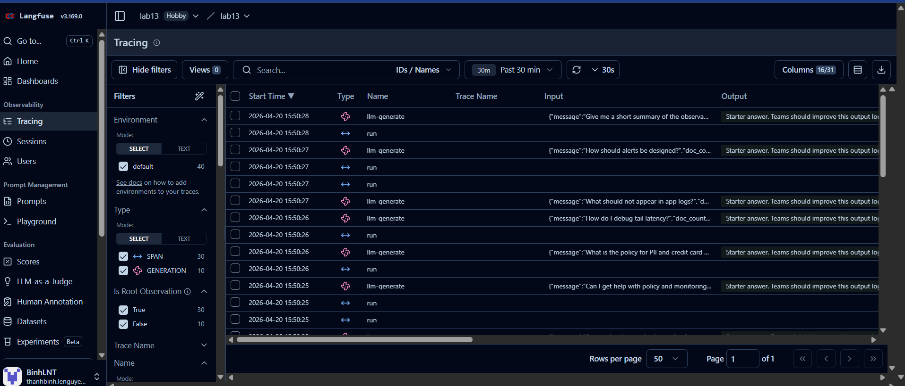
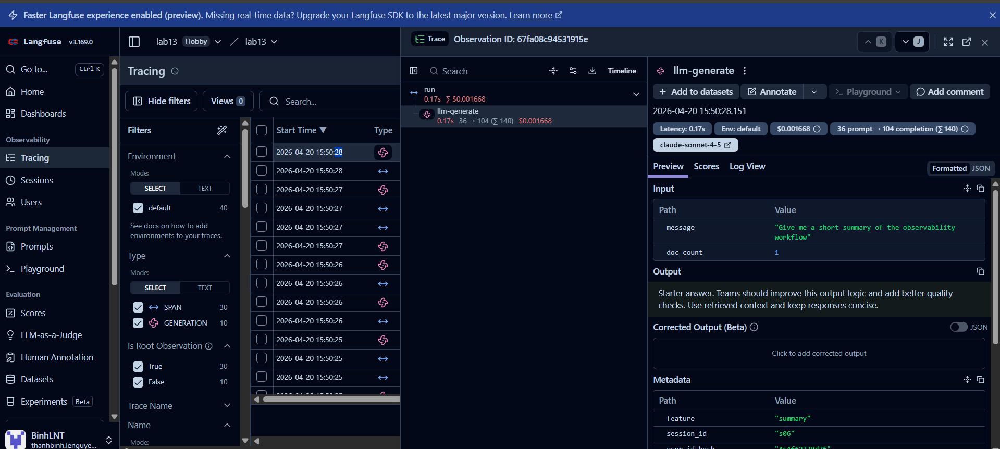
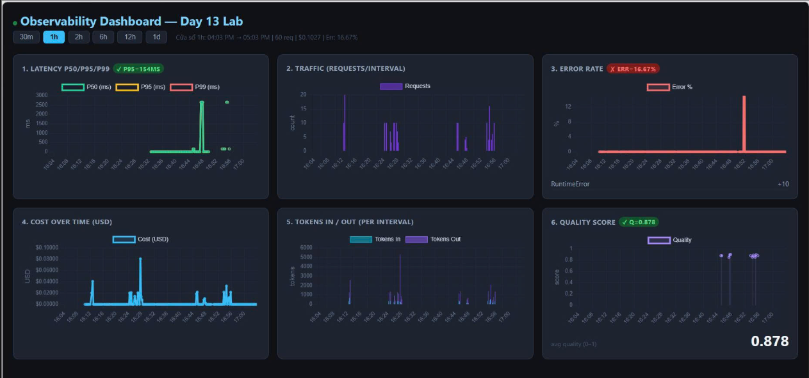
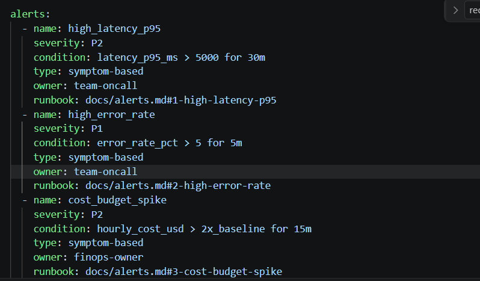

# Day 13 Observability Lab Report

> **Instruction**: Fill in all sections below. This report is designed to be parsed by an automated grading assistant. Ensure all tags (e.g., `[GROUP_NAME]`) are preserved.

## 1. Team Metadata
- [GROUP_NAME]: Team03-E402
- [REPO_URL]: https://github.com/tuanvan03/Lab13-Observability
- [MEMBERS]: 
  - Member A: [Ninh Quang Trí] | Role: Logging & PII
  - Member B: [Vũ Minh Khải] | Role: Tracing & Enrichment + Load Test
  - Member C: [Đoàn Văn Tuấn] | Role: SLO & Alerts
  - Member D: [Lê Nguyễn Thanh Bình] | Role: Demo & Report +  Dashboard

---

## 2. Group Performance (Auto-Verified)
- [VALIDATE_LOGS_FINAL_SCORE]:100/100
- [TOTAL_TRACES_COUNT]: 126
- [PII_LEAKS_FOUND]: 0

---

## 3. Technical Evidence (Group)

### 3.1 Logging & Tracing
- [EVIDENCE_CORRELATION_ID_SCREENSHOT]: 
- [EVIDENCE_PII_REDACTION_SCREENSHOT]: 
- [EVIDENCE_TRACE_WATERFALL_SCREENSHOT]: 
- [TRACE_WATERFALL_EXPLANATION]: 

### 3.2 Dashboard & SLOs
- [DASHBOARD_6_PANELS_SCREENSHOT]: 
- [SLO_TABLE]:
| SLI | Target | Window | Current Value |
|---|---:|---|---:|
| Latency P95 | < 3000ms | 28d | 154ms |
| Error Rate | < 2% | 28d | 0% |
| Cost Budget | < $2.5/day | 1d | ~$0.10 |

### 3.3 Alerts & Runbook
- [ALERT_RULES_SCREENSHOT]: 
- [SAMPLE_RUNBOOK_LINK]: - [SAMPLE_RUNBOOK_LINK]: [docs/alerts.md#1-high-latency-p95](docs/alerts.md#1-high-latency-p95)

---

## 4. Incident Response (Group)
- [SCENARIO_NAME]:   rag_slow
- [SYMPTOMS_OBSERVED]: Độ trễ (latency) của hệ thống tăng vọt đáng kể khi thực hiện các truy vấn yêu cầu truy xuất dữ liệu từ RAG, làm ảnh hưởng đến thời gian phản hồi của agent.
- [ROOT_CAUSE_PROVED_BY]: Sự cố được xác định bởi log event incident_enabled với `correlation_id: req-66576059`. Phân tích Trace ID này trên Langfuse cho thấy span của hàm retrieve trong `app/mock_rag.py` bị chặn bởi lệnh `time.sleep(2.5)`, khớp chính xác với kịch bản giả lập `rag_slow`.
- [FIX_ACTION]: Đã thực hiện gọi API `/incidents/rag_slow/disable` để vô hiệu hóa kịch bản giả lập, khôi phục trạng thái hoạt động bình thường của hệ thống.
- [PREVENTIVE_MEASURE]: Thiết lập ngưỡng timeout cho các cuộc gọi truy xuất dữ liệu để tránh tình trạng hệ thống bị treo do RAG chậm.

---

## 5. Individual Contributions & Evidence

### [Ninh Quang Trí]
- [TASKS_COMPLETED]: Triển khai cấu trúc JSON logging; xây dựng module PII scrubber trong `app/pii.py` và tích hợp vào `app/logging_config.py` để redact thêm hộ chiếu và địa chỉ nhà.
- [EVIDENCE_LINK]: ``` 85809c2c7a8e32570be341841669e943bc9d331c ```

### [Vũ Minh Khải]
- [TASKS_COMPLETED]: Sửa lỗi để config langfuse, cấu hình enrichment log trong `app/main.py`; thực hiện `load_test.py` để kiểm thử độ chịu tải và tạo dữ liệu traces. Chỉnh sửa dashboard (Cùng bạn Bình)
- [EVIDENCE_LINK]: ``` 1fc6203f7c31687c5f21e7bb2707142e113abbc7, 7b45a3a3280e06dc2f3fca08bb5b684d07d6e932, 9d128ce12de959b879d6bfbf7cd484e149a8d2d6, 1cbd221e06a56583a0ae91b198827fe3e6d96b1f ```

### [Đoàn Văn Tuấn]
- [TASKS_COMPLETED]: Hoàn thiện `CorrelationIdMiddleware` để tạo và truyền ID qua header; Thiết lập các ngưỡng SLO trong `config/slo.yaml`; xây dựng bộ alert rules trong `config/alert_rules.yaml` và viết runbook chi tiết trong `docs/alerts.md` cho các tình huống sự cố.
- [EVIDENCE_LINK]: 

### [Lê Nguyễn Thanh Bình]
- [TASKS_COMPLETED]: Thiết kế Dashboard 6 panels theo spec; cấu hình auto-refresh và SLO line; tổng hợp bằng chứng kỹ thuật và soạn thảo nội dung hoàn chỉnh cho báo cáo `blueprint-template.md`.
- [EVIDENCE_LINK]: 

---

## 6. Bonus Items (Optional)
- [BONUS_COST_OPTIMIZATION]: (Description + Evidence)
- [BONUS_AUDIT_LOGS]: (Description + Evidence)
- [BONUS_CUSTOM_METRIC]: (Description + Evidence)
